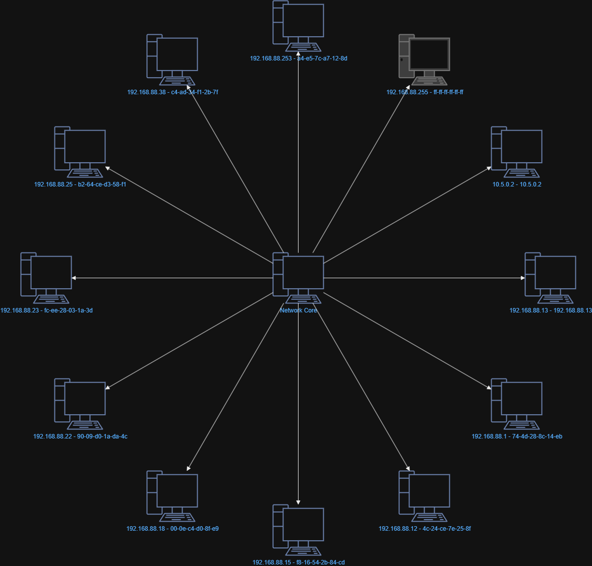

# Dynamic Network Mapper with History

Scans network devices and visualizes network topology.

## Features

- ARP/ICMP scan to find active devices.
- Exports a Draw.io diagram of the network topology.
- Supports both Windows (`arp -a`) and Linux (`/proc/net/arp`).

## Example Network Diagram

Below is an automatically generated network map using Draw.io export:



## Value

Helps system administrators monitor networks without expensive tools.  
Provides a clear view of connected devices and their relationships.

## Usage

1. Run the script:
   ```bash
   python network_mapper.py
